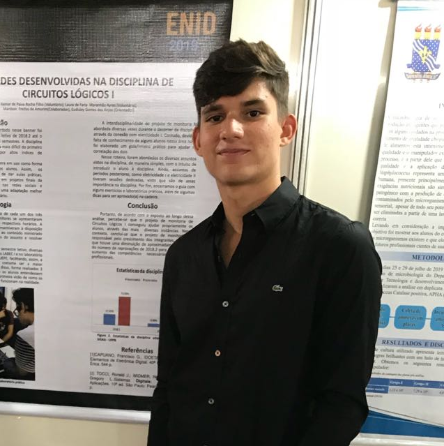
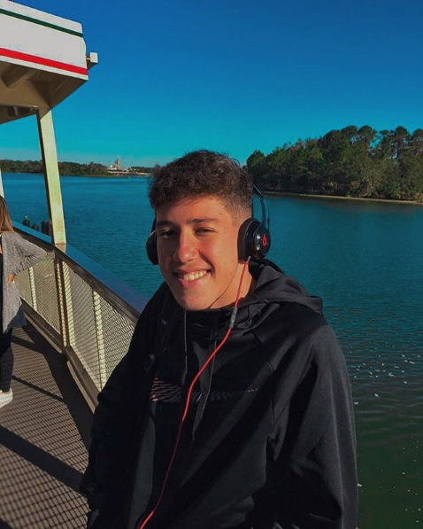

 
 
  

# Deep Learning Class 2020.1

Repository dedicated to Deep Learning Course took at the Federal University of Paraíba, Brazil

---

## Table of Contents
- [Deep Learning Class 2020.1](#deep-learning-class-20201)
  - [Table of Contents](#table-of-contents)
  - [Assignments](#assignments)
  - [Clone](#clone)
  - [Authors](#authors)

---

## Assignments

*  [Assignment #1: Introduction to Neural Networks](https://github.com/jpvt/Deep_Learning/tree/main/Assignment_1)

In this assignment, we presented solutions for exercises proposed by the course professor. Each problem is described in its respective Jupyter Notebook. Besides, we implemented a neural network from scratch, feel free to install and test it.
More information available in the assignment's folder.

---

## Clone

- Clone this repo to your local machine using
    > https://github.com/jpvt/Deep_Learning.git

---
## Authors

|<a href="https://www.linkedin.com/in/jpvt/" target="_blank">**João Pedro Vasconcelos**</a> | <a href="https://linkedin.com/in/itamarrocha" target="_blank">**Itamar Filho**</a>      |<a href="https://www.linkedin.com/in/jo%C3%A3o-wallace-b821bb1b0/" target="_blank">**João Wallace Lucena**</a> | <a href="https://www.linkedin.com/in/felipehonoratodesousa/" target="_blank">**Felipe Honorato**</a>      |
|:-----------------------------------------------------------------------------------------:|:---------------------------------------------------------------------------------------:||:-----------------------------------------------------------------------------------------:|:---------------------------------------------------------------------------------------:| 
|                    </img>                            |                </img>                          |                    </img>                            |                </img>                          |
|               <a href="http://github.com/jpvt" target="_blank">`github.com/jpvt`</a>      |  <a href="https://github.com/ItamarRocha" target="_blank">`github.com/ItamarRocha`</a>  |               <a href="http://github.com/joallace" target="_blank">`github.com/joallace`</a>      |  <a href="https://github.com/Felipehonorato1" target="_blank">`github.com/Felipehonorato1`</a>  |
